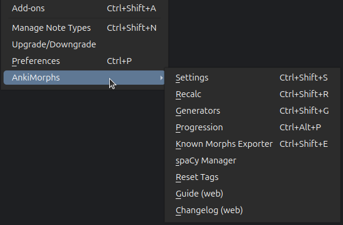

# Settings

To display the settings dialog either use `Ctrl+Shift+S` or go to `Tools -> IntMorphs -> Settings`

The settings are separated into the following sections:

* [General](settings/general.md): miscellaneous settings
* [Note Filter](settings/note-filter.md): set which cards you want IntMorphs to analyze and sort
* [Extra Fields](settings/extra-fields.md): have IntMorphs add extra information to your cards
* [Tags](settings/tags.md): rename the tags IntMorphs uses
* [Preprocess](settings/preprocess.md): adjust the text IntMorphs analyzes  
* [Card Handling](settings/card_handling.md): adjust how IntMorphs handles cards
* [Algorithm](settings/algorithm.md): adjust the [scoring algorithm](../usage/recalc.md#scoring-algorithm)
* [Shortcuts](settings/shortcuts.md): adjust keyboard shortcuts